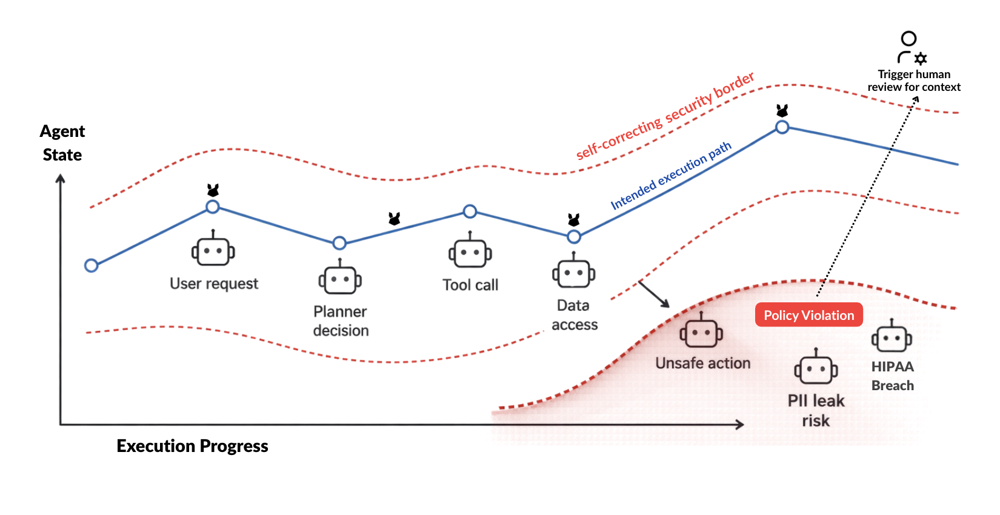

<h1 align="center">CoreAX</h1>

<h3 align="center"><strong>The safest way to monitor, enforce context-aware guardrails, and improve your AI agents as conditions change</strong></h3>
<p align="center"><em>CoreAX is an open-source Runtime Assurance SDK for AI agents in production.</em></p>
<p align="center"><em>Built to interoperate with any stack.</em></p>

<p align="center">
  <a href="https://www.npmjs.com/package/@coreax/sdk"></a>
  <a href="https://www.npmjs.com/package/@coreax/sdk"></a>
  <a href="https://github.com/teluashish0/coreax-sdk/blob/main/LICENSE"></a>
</p>

<p align="center">
  <a href="https://github.com/teluashish0/coreax-sdk">Repository</a> •
  <a href="#modules">Modules</a> •
  <a href="#security-guarantees">Security guarantees</a>
</p>

---

<p align="center">
  
</p>

---

## What is CoreAX?

CoreAX, or Core Agent Experience, is an open-source SDK for governing AI
workflows with context-aware guardrails that evolve alongside your agents. It
captures and curates high-quality local trajectory data from orchestrator
decisions, agent actions, tool calls, policy outcomes, and human-in-the-loop
interventions to support safe, continuous agent improvement.

Models change, prompts evolve, tools are added, and attack techniques adapt.
CoreAX provides a self-correcting security boundary that observes behavior,
enforces deterministic constraints before side effects, preserves verifiable
evidence, and proposes constrained improvements without granting itself new
permissions.

The SDK is standalone and offline-capable. It evaluates untrusted AI and agent
actions before caller-owned code executes them, and every external integration
remains explicit and caller-controlled.

CoreAX requires Node.js 20 or newer.

## Installation

```sh
npm install @coreax/sdk
```

## Local quick start

Create an enforcing guard with an explicit policy. The callback passed to
`execute` runs only when the decision permits it; a blocked action throws before
the callback is reached.

```ts
import { createCoreaxGuard } from "@coreax/sdk/guard";

const guard = createCoreaxGuard({
  mode: "enforce",
  provider: {
    local: {
      policy: {
        version: 1,
        tools: {
          allow: ["records.read@1.0"],
          requirePinnedVersions: true,
        },
        enforcement: {
          denyOn: [
            "tool_not_in_allowlist",
            "version_unpinned",
          ],
        },
      },
    },
  },
});

const result = await guard.execute(
  {
    kind: "tool_call",
    target: "records.read@1.0",
    content: { id: "42" },
    context: { runId: "run-001", nodeId: "support-agent" },
  },
  async (input) => {
    const { id } = input.content as { id: string };
    return readRecord(id);
  },
);

console.log(result.decision.outcome, result.value);
```

Policies may also be loaded from an explicit JSON or YAML `policyPath`. CoreAX
does not discover configuration or read environment variables.

## Architecture

CoreAX sits between an untrusted proposal and the code that can cause a side
effect:

1. An agent proposes a tool call, API call, or outbound message.
2. A guard, middleware function, or runtime adapter evaluates it against an
   explicit policy.
3. Deterministic rules allow, redact, block, or require approval.
4. Caller-owned code performs an allowed action.
5. Local audit, governance, and risk modules record and assess the result.
6. Policy learning can produce constrained proposals in shadow mode for an
   explicit promotion decision.

The evaluator can combine evidence, graph context, retries, recovery,
contradictions, and orchestration state. A caller-supplied semantic calibrator
is advisory: it cannot override a deterministic hard deny or approval
requirement.

## Modules

| Import | Purpose |
| --- | --- |
| `@coreax/sdk` | Primary CoreAX exports |
| `@coreax/sdk/guard` | `createCoreaxGuard`, guard policies, and guarded execution |
| `@coreax/sdk/middleware` | Local security middleware and request metadata |
| `@coreax/sdk/evaluator` | Deterministic contextual evaluation |
| `@coreax/sdk/policy` | Policy parsing, validation, and allowlist matching |
| `@coreax/sdk/runtime-adapter` | Caller-configured runtime enforcement |
| `@coreax/sdk/audit` | Signed append-only audit logs and verification |
| `@coreax/sdk/signer` | Canonicalization, hashing, and keyed Ed25519 signing |
| `@coreax/sdk/escalation` | Memory/file review state and scoped approval capabilities |
| `@coreax/sdk/governance` | Local governance records, evidence compaction, and execution reporting |
| `@coreax/sdk/runtime-risk` | Deterministic behavior, path, state, exposure, and mandate risk |
| `@coreax/sdk/policy-learning` | Shadow learning, simulation, safety checks, promotion, and rollback |
| `@coreax/sdk/instrumentation` | CoreAX configuration, context, decorators, and wrappers |
| `@coreax/sdk/integrations/custom-agent` | Framework-neutral tool and message adapter |
| `@coreax/sdk/core` | Interfaces for caller-supplied policy, audit, and approval components |

## Configuration

Configuration is supplied directly to each API. File-backed components accept
explicit paths; `./.coreax` is the conventional local state root.

```ts
import { initCoreax } from "@coreax/sdk/instrumentation";

const coreax = initCoreax({
  stateRoot: "./.coreax",
  application: {
    name: "support-agent",
    version: "1.0.0",
    environment: "production",
  },
  nodes: {
    support: {
      kind: "agent",
      name: "Support agent",
    },
  },
  onEvent(event) {
    localEventQueue.push(event);
  },
});

console.log(coreax.directories.auditDir);
```

Importing CoreAX does not create state. `initCoreax()` creates its configured
instrumentation directories, while file-backed escalation and governance
components and `CoreaxAppender` create their state only when their
`initialize()` methods are called. Installing CoreAX middleware performs that
middleware-owned audit initialization. Durable writes are serialized and use
recovery-safe local records.

Interfaces such as `PolicyProvider`, `RuntimeAdapter`, `AuditSink`,
`ApprovalProvider`, and `SemanticCalibrator` are available for integrations
owned and configured by the caller. CoreAX does not select an endpoint,
credential, transport, or storage service for them.

## Custom-agent integration

The framework-neutral adapter maps tool calls and outbound messages to guard
inputs while leaving execution, transport, and application state under caller
control.

```ts
import { createCustomAgentAdapter } from "@coreax/sdk/integrations/custom-agent";

const agent = createCustomAgentAdapter({ guard });

const toolResult = await agent.executeTool(
  {
    name: "records.read@1.0",
    arguments: { id: "42" },
    context: { agentId: "support-agent", sessionId: "session-001" },
  },
  ({ id }) => readRecord(id),
);

await agent.sendOutboundMessage(
  {
    target: "customer",
    message: "Your request is complete.",
    context: { runId: "run-001" },
  },
  (message) => sendMessage(message),
);
```

## Security guarantees

- No account, database, service credential, or implicit outbound request is
  required.
- Enforcement is deterministic and local unless the caller explicitly supplies
  an integration.
- Missing, expired, replayed, incorrectly scoped, or wrongly signed approval
  capabilities fail closed.
- Approval capabilities are keyed Ed25519 signatures with explicit action,
  scope, expiry, and nonce claims.
- Audit verification detects modified records, truncated logs, and unexpected
  signers relative to the signed local head.
- Detecting restoration of an entire older-but-valid state tree requires the
  caller to retain the latest signed head or policy version outside that
  writable state root.
- Learned policy changes remain proposals by default. Proposals and promotion
  cannot broaden permissions or remove mandatory denies, and promotion is an
  explicit, signed operation.
- Signed rollback may explicitly restore exact non-wildcard permissions from a
  prior version. Wildcard expansion and mandatory-deny removal remain forbidden.
- The application retains control of side effects and should place every
  untrusted action behind a CoreAX enforcement boundary.
